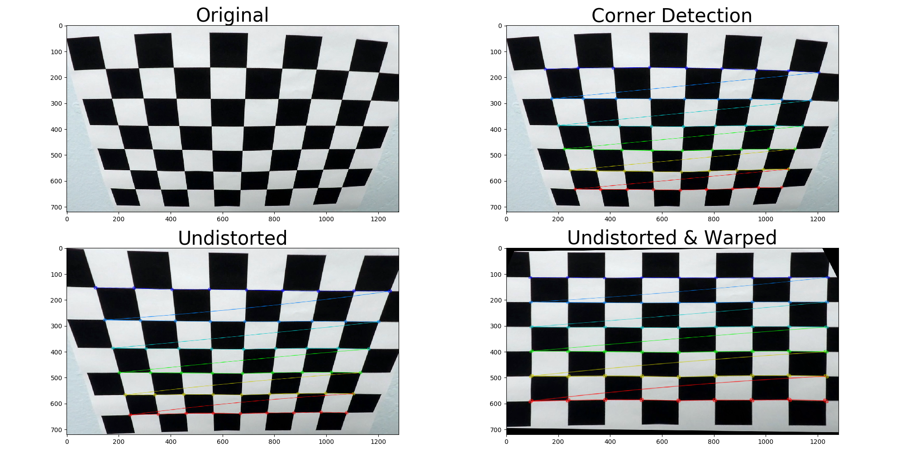
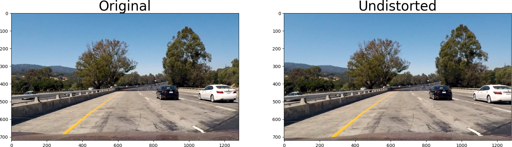
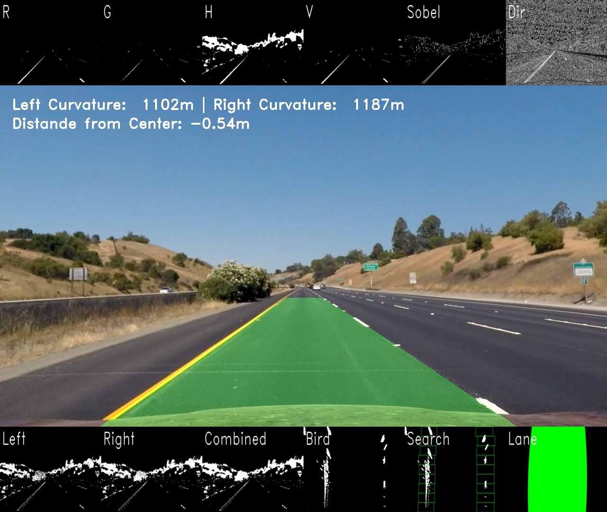
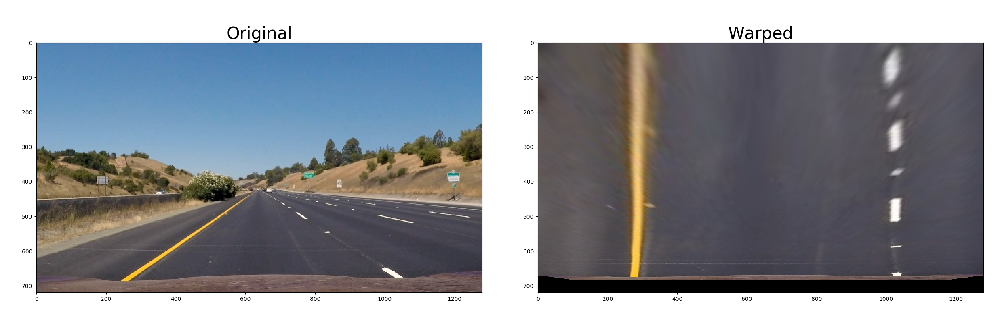
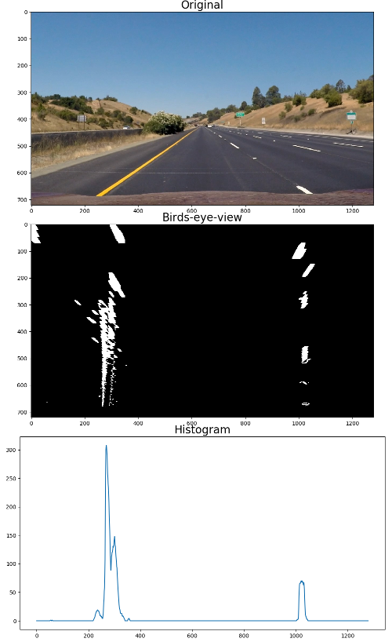
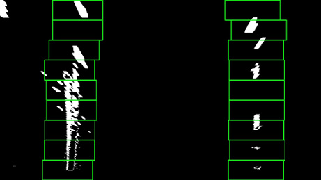
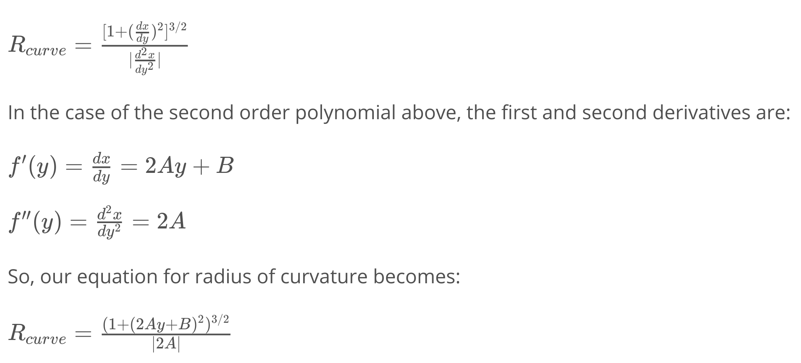
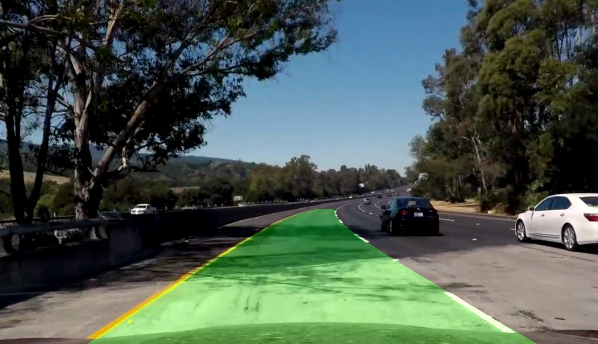

# Udacity Self Driving Car Nanodegree

## Term 1, Project 4 -- Advanced Lane Finding 

### Name: Ciaran Murphy
### Date: 24-Nov-2017

---

The goals / steps of this project are the following:

* Compute the camera calibration matrix and distortion coefficients given a set of chessboard images.
* Apply a distortion correction to raw images.
* Use color transforms, gradients, etc., to create a thresholded binary image.
* Apply a perspective transform to rectify binary image ("birds-eye view").
* Detect lane pixels and fit to find the lane boundary.
* Determine the curvature of the lane and vehicle position with respect to center.
* Warp the detected lane boundaries back onto the original image.
* Output visual display of the lane boundaries and numerical estimation of lane curvature and vehicle position.

## [Rubric](https://review.udacity.com/#!/rubrics/571/view) Points

The implementation script is in the main workspace of the git repo and is called
`lane_finding.py`. It expects command line args as follows:

```shell
(carnd-term1) $ python ./lane_finding.py -h
usage: lane_finding.py [-h] [-i PIPELINE_INPUT] [-o PIPELINE_OUTPUT]
                       [-d DEBUG_MODE] [-s] [-0 START] [-1 END]

optional arguments:
  -h, --help            show this help message and exit
  -i PIPELINE_INPUT, --input PIPELINE_INPUT
                        Video or image to pass through the processing
                        pipeline. Defaults to `INPUT_VIDEO` as configured
                        inside this script. Supported media types are mp4, jpg
                        and png.
  -o PIPELINE_OUTPUT, --output PIPELINE_OUTPUT
                        Destination to store output. If an mp4 video filename
                        is given, a new video of that name will be created. If
                        passing in a single image, specify a directory name
                        here and images will be created in that directory for
                        each stage of the pipeline. Defaults to `OUTPUT_VIDEO`
                        as configured inside this script.
  -d DEBUG_MODE, --debug DEBUG_MODE
                        Optional. If included and >-1, turn on debug output
                        which will write all intermediary images to
                        ./output_images for every N frames.
  -s, --stream          Optional. If included, constantly update an image
                        called ./output.jpg with the current pipeline. You can
                        then use eg `feh -R 0.2 output.jpg` to monitor
                        progress.
  -0 START, --t0 START  Optional. Clip an input video to start at t0 seconds.
  -1 END, --t1 END      Optional. Clip an input video to end at t1 seconds.
(carnd-term1) $ 

```

Here I will consider the rubric points individually and describe how I addressed each point in my implementation.

---

### Camera Calibration

#### 1. Briefly state how you computed the camera matrix and distortion coefficients.

Although it's not normally obvious, all cameras introduce some distortion to
the images they make. The most common forms of distortion are radial and
tangential. Before attempting to detect lane lines, it's important to correct
for these distortion types so that the image is as representative of the real
world as possible. The code snippet below is taken from the `undistort(img)`
method implemented for this project and uses opencv's `cv2.calibrateCamera()`
method to undistort the image. The code is implemented in the file
`lane_finding.py`. Below is the method signature for
reference. 

```python
def undistort(img, cmap='BGR'):
    """Undistort an image. If the calibration has not been performed already,
    perform it now but only once for the lifetime of this python process.

    This function leverages two less well known Python features: embeded
    functions (a function within a function) and the fact that attributes can
    be assigned to Python functions (for example, see the attribute
    `calibrate.ready` below). An interesting characteristic of method
    attributes is that they are persistent across multiple calls of that
    process, thus can be used to ensure that a particular block of code runs
    once and only once for the lifetime of a Python program.

    Args:

        img: the image to undistort. If not in BGR, must specify RGB as cmap
        cmap: 'RGB' or 'BGR', defaults to 'BGR' inline with cv2.imread()

    Returns:

        udist_img: an undistorted version of img.

    """
```

However before calling this method, it is necessary to generate the calibration
data required for the camera. This is accomplished by processing as many images
of chessboards from the camera as possible. These images are passed through
opencv's `cv2.findChessBoardCorners()` method which finds the corners in the
image (meaning the places where black corners touch). Using these corner
points, it is possible to calculate the distortion parameters. With these
parameters, we can undistort all future images taken with that specific camera.

Once the distortion has been removed from the image, it can be warped to change the
perspective to whatever is needed. In the example below, I have warped the
image so that it appears as though the camera was directly in front of the
chessboard when the picture was taken. This will be an important idea when we
get to lane finding and we need to convert an image of the lane lines to
a birds-eye-view so that we can calculate the parameters of a 2nd order
polynomial that best describes the curvature of each lane line. Warping and
unwarping is performed using OpenCV's `cv2.getPerspectiveTransform()` method
which returns a transform matrix M. This matrix can then be applied to new
images to convert the camera angle. 

```python
def warp(img, src=None, dst=None, inverse=False, offset=0):
    """Warp an image so that it looks like the camera took the image from
    a different angle. For example, this could mean converting a front facing
    camera image to a top-down birds-eye-view camera.

    Args:
        img: the original image that will be warped
        src: 4-tuple of points in the source image. If left as `None`, a default 
            will be created inside the method.
        dst: 4-tuple of points to map src to in the destination image. If left as `None`, 
            a default will be created inside the method.
        inverse: if True, perform an inverse warp from dst to src instead of the other way around
        offset: offset for the destination image

    Returns:
        warped: a warped img where all points are mapped to the calculated
            perspective transform matrix

    """
```

Below is an example of the process on one of the actual calibration images for
this project.



Side note: in the python I implemented for this project, the calibration data
will be search for locally on disk before running the calibration process. If
a pickle file is found, then it is assumed that the pickled data can be used
and re-calibrating is not performed. Only if there is no calibration data
available will the procedure run. This all happens when the 1st call to
`undist()` is made for the 1st image in the sequence.

### Pipeline (single images)

#### 1. Provide an example of a distortion-corrected image.

Below is an example of distortion correction on one of the test images. This
correction was performed according to the process described above.



#### 2. Describe how (and identify where in your code) you used color transforms, gradients, etc 

To strip out unwanted noise and isolate the lane lines I used a pipeline as
follows:

* Apply a distortion correction to raw images.
* Use color transforms, gradients, etc., to create a thresholded binary image.
  * Red channel filter
  * Green channel filter
  * Hue channel filter
  * Value channel filter
  * Sobel filter
  * Directional filter (not used in the end)
  * Magnitudinal filter

The below code snippet from `lane_finding,py` shows the steps.

```python
    # Steps (1) and (2): calibration (happens automatically) and distortion correction
    undist = undistort(img)

    # Step (3): thresholding to produce a binary image
    color_r = color_threshold(undist, tscheme='RGB', channel='R', thresh=(220, 255))
    color_g = color_threshold(undist, tscheme='RGB', channel='G', thresh=(200, 255))
    color_h = color_threshold(undist, tscheme='HSV', channel='H', thresh=(20, 100))
    color_v = color_threshold(undist, tscheme='HSV', channel='V', thresh=(210, 256))

    sobel   = sobel_threshold(undist, orient='x', ksize=3, thresh=(20, 100))
    direct  = dir_threshold(undist, ksize=3, thresh=(0.7, 1.3))
    mag     = mag_threshold(undist, ksize=3, thresh=(20, 100))

    # The L channel in HLS picks up distant lane lines, in particular when the road
    # surface is different in the foreground than the background. However it also
    # picks up a lot of noise in the foreground. This noise can be removed using a 2D
    # convolution with the code below, but in the end I removed HLS color space altogether
    # in favor of HSV instead. I leave the code below for reference.
    #kernel = np.array([[-1, -1, -1], [-1, 5, -1], [-1, -1, -1]])
    #color_l_conv = cv2.filter2D(color_l, -1, kernel)
    #color_l_conv[color_l_conv > 0] = 1

    # Combine all images
    right = (sobel | color_g | color_v) ^ color_h 
    left = ((color_h | sobel | color_r) & mag) ^ right
    combined = left | right

    # Step (4): perspective transform
    binary_warped = warp(combined)

```

After finding the lanes, other steps are performed like drawing a polygon on
back onto the original image. These steps are described later in this document.

Below is a single composite image showing all the stages of this pipeline. For
more examples, broken out as individual images, see the `output_images` directory
of the git repo.




#### 3. Describe how (and identify where in your code) you performed a perspective transform 

To correct distortion it is necessary to have a set of points in the original
image that have a known position in an (as yet non-existing) undistorted
version. A good candidate for this is text or any object of known shape, such
as a rectangular traffic sign. For our purposes in this project, I selected
a rectangular region of the lane markings on both sides of the road and
manually generated the matrix below. This matrix is then applied to all images
in the project. In a real implementation this would need to be improved upon by
e.g. dynamically computing the matrix based on the contents of the image, such
as known lane widths and known lane line lengths.

```python
def warp(img, src=None, dst=None, inverse=False, offset=0):
    """Warp an image so that it looks like the camera took the image from a different angle. For 
    example, this could mean converting a front facing camera image to a top-down birds-eye-view camera.

    Args:
        img: the original image that will be warped
        src: 4-tuple of points in the source image. If left as `None`, a default 
            will be created inside the method.
        dst: 4-tuple of points to map src to in the destination image. If left as `None`, 
            a default will be created inside the method.
        inverse: if True, perform an inverse warp from dst to src instead of the other way around
        offset: offset for the destination image

    Returns:
        warped: a warped img where all points are mapped to the calculated perspective transform matrix

    """
```

The matrix that I manually generated for `src` and `dst` above was the
following:

```python
        src = np.array(((521, 504), (771, 504), (1022, 670), (280, 670)), dtype="float32")
        dst = np.array(((290, 504), (1032, 504), (1022, 670), (280, 670)), dtype="float32")

```

Here is an example of this `warp()` function in action on an image:



#### 4. Describe how (and identify where in your code) you identified lane-line pixels 

After isolating pixels that specifically belong to lane markings and performing
a birds-eye-view warp of those pixels, it is possible to describe the left and
right lane lines using a 2nd order polynomial. A 2nd order poly takes the form
__f(y) = Ay^2 + By + C__, where A, B, and C are coefficients. We are using
__f(y)__ and not __f(x)__ since the lane lines are close to vertical, not
horizontal, therefore we want to scale __y__ with respect to __y__, and not
__x__ with respect to __y__.

To find the points matching the start of the lane lines, I took a histogram of
the sum of pixel values for the bottom half of the image. The max points on
this histogram provide the horizontal position at the bottom of the image for
each of the lane lines. This gives a place to start from to discover the rest
of the relevant pixels.



I then used a sliding window approach to finding the specific areas though the
image where the lane pixels move through. The process is illustrated in the
following image where I start at the bottom and work upwards searching for
areas that contain pixels. The code for this is implemented in the function
`get_polys_full()` in `lane_finding.py`.



Once we have the initial positions of the lanes, it is not needed to re-run
a full scan of all subsequent images. In fact it's enough to only scan a margin
around the new images. This doesn't seem to speed up the running of the script
but does significantly stabalize the polinomial fitting proceedure.  For
implementation, see `get_polys_margin()`.

```python
def get_polys_margin(binary_warped, left_fit, right_fit, margin=100):
    """Get polynomials within a margin of an image given a pre-exiting polynomial result.

    Args:
        binary_warped: the binary warped image
        left_fit: the pre-existing left fit
        right_fit: the pre-existing right fit
        margin: margin to search within
    Returns:
        tuple containing an image of the search, left and right x & y pixels,
        left polynomial, right polynomial

    """
```

Now that we have points that we assume correspond to the lane lines, we can use
numpy's `np.polyfit()` method to get the coefficients of a 2nd order polynomial
that matches our lane lines.

At this point it's important to think about sanity checking the results. It's
not possible to remove all noise from the images and therefore sometimes the
poly fit will be off. I employed two mechanisms to check the sanity of the
results and applied them separately to the left and right lane lines. The 1st
check is to see if the instantaneous rate of change of the polynomial is too
high (meaning if the absolute value of the derivative __2Ay + By__ is larger
than a configured threshold). The 2nd check was against a history of past
values - if the current value was too different to the last __N__ values, then
it is considered an error. If an error is detected, a full image scan is
preformed and the sanity checked again. If this fails, the script falls back to
the previous image's results as a last resort.

The code for calculating the derivative (ie. rate of change) of the polynomial
is as follows (taken from `sanity_check()` on line 687):

```python
        get_dx_left = lambda: np.mean( 2*poly_left[0]*ploty + poly_left[1] )
        get_dx_right = lambda: np.mean( 2*poly_right[0]*ploty + poly_right[1] )

```

#### 5. Radius of curvature and position of vehicle

The radius of curvature can be calculated from the polynomial according to the
following formula:



For details of how this works, there is a very good tutorial 
[here](https://www.intmath.com/applications-differentiation/8-radius-curvature.php).

The code for this calculation looks like below and can be found in the method
below.

```python
def get_real_world_measurements(binary_warped, leftx, lefty, rightx, righty):
    """Calculate real world measurements from pixel positions.
    
    Find the radius of curvature in real world dimensions. We are using a hard
    coded dimension conversion here for simplicity (`ym_per_pix` and `xm_per_pix`)
    but in a real system it would be necessary to use some kind of markers in the
    image that are of known dimensions. This is needed for example to handle cases
    where the road is ascending or descending a hill.

    Args:
        binary_warped:  the binary, warped version of the current image
        leftx, lefty: points for left x and y
        rightx, righty: points for right x and y

    Returns:
        real world measurements in meters for curvature and distance of the car from lane center
     
    """

    <code ommited...>

    poly_left_cr = np.polyfit( lefty * ym_per_pix, leftx * xm_per_pix, 2 )
    poly_right_cr = np.polyfit( righty * ym_per_pix, rightx * xm_per_pix, 2 )

    <code ommited...>

    # Calculate radius of curvature in meters
    left_curve_rad = (((1 + (2*poly_left_cr[0]*y_eval*ym_per_pix + \
            poly_left_cr[1])**2)**1.5) / np.absolute(2*poly_left_cr[0]))
    right_curve_rad = (((1 + (2*poly_right_cr[0]*y_eval*ym_per_pix + \
            poly_right_cr[1])**2)**1.5) / np.absolute(2*poly_right_cr[0]))

    <code ommited...>

```

#### 6. Provide an example image of your result plotted back down onto the road 

Here is an example of the detected lane being projected back onto an original
image. 

[](https://youtu.be/F5Duo2Uap1M)

---

### Pipeline (video)

Finally, here is a link to the processed project video.

* [local copy](./project_video_out.mp4)

* [youtube](https://youtu.be/F5Duo2Uap1M)

---

### Discussion

This was a challenging project that took quite a while for me to complete. It
has some great examples of how to process images and as a learning vehicle was
excellent. A major problem for the processing was the shadows that fall on the
road in some places. The changes in the color of the road surface also caused
major issues and took a while for me to overcome. 

It's interesting that the approach didn't work all that well on the challenge
videos. One reason for this is that any lines in the middle of the road (as in
the 1st challenge video) are very easily interpreted as not being lane markings
by humans, but it's much harder for a program. Similarly, the trees on the side
of the road in the 2nd challenge video cause the color thresholding to go
haywire. It just goes to show, that it's one thing to design a pipeline that
works for a single video example, but creating a generic application that could
work on any roads in any conditions would be a much, much harder task!


